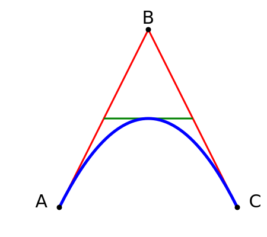

# Hello world~!
## h2
### h3

| h1 | h2 |
| --- | --- |
| a | b |

mathjax: $e=mc^2$  
mathjax: $$e=m^2$$

mathjax: $ e=mc^2 $  
mathjax: $$ e=m^2 $$

#### unordered list
- list item 1
- list item 2
- list item 3

#### ordered list 1
1. item 1
1. item 2
1. item 3
---

---
<svg xmlns="http://www.w3.org/2000/svg" version="1.1">
  <text x="0" y="150" fill="lightblue">I love SVG</text>
</svg>

#### ordered list 2
1. item a
2. item b
3. item c

